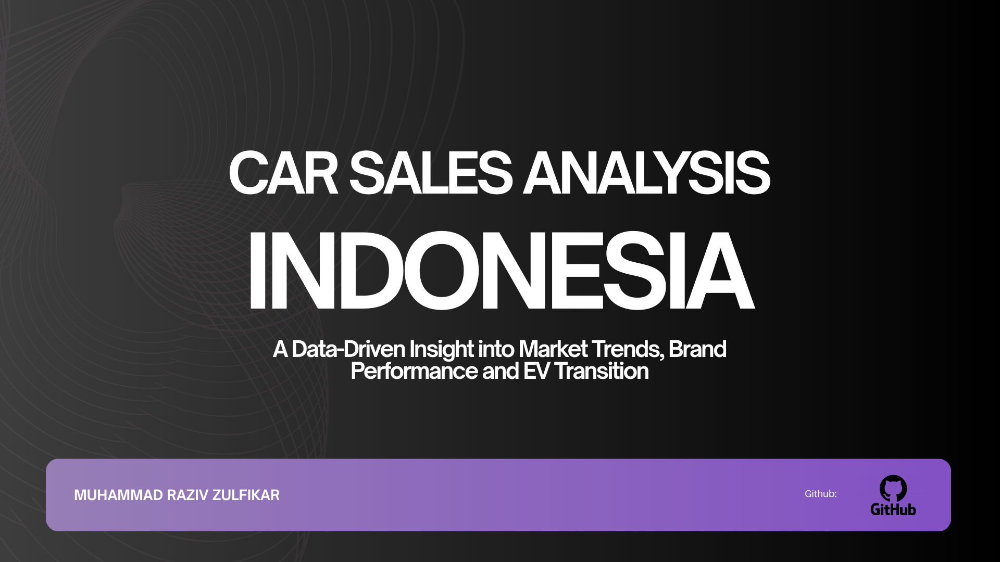

# 🚗 Gaikindo Car Sales Analysis (2022-2025)

Proyek ini merupakan analisis terhadap industri otomotif Indonesia menggunakan data mentah dari **GAIKINDO**. Melalui proses *end-to-end data analytics*, proyek ini membahas tren pasar, performa brand, hingga transisi energi kendaraan listrik (EV) di tingkat nasional. Selain itu pada proyek ini juga dibuatn **Interactive Dashboard** untuk analisisn dan monitoring lebih detail.

---

## 📊 Project Insights

  
   
  <i>✨ Klik untuk melihat analisis lebih detail</i>

Berdasarkan analisis data dari tahun 2022 hingga 2025, ditemukan beberapa pola krusial:

* **Tren Penurunan Pasar**: Pasar mengalami **penurunan penjualan pada 3 tahun terakhir** yang kemungkinan disebabkan oleh **melemahnya ekonomi masyarakat**.
* **Dinamika Musiman**: Penjualan secara konsisten memuncak di bulan **Maret** (respon terhadap tradisi Mudik Lebaran) dan mengalami penurunan tajam di bulan **April**.
* **Dominasi & Penantang Baru**: **Toyota** tetap memimpin pasar dengan *share* di atas 30%, namun **BYD** muncul sebagai penantang dengan pertumbuhan volume yang sangat agresif (*Most Improved Brand* 2 tahun berturut-turut).
* **Transisi Energi**: Terjadi pertumbuhan progresif pada segmen **Hybrid** dan **EV**. Data menunjukkan Hybrid menjadi teknologi transisi yang paling diterima konsumen sebelum infrastruktur EV matang sepenuhnya.
* **Kekuatan Produksi Lokal**: Sekitar **85%** kendaraan adalah unit **CKD** (rakitan dalam negeri), yang menjamin ketersediaan suku cadang dan melindungi pasar dari volatilitas kurs.
* **Model Terlaris**: **Toyota Innova** memimpin segmen mobil penumpang, **Daihatsu Sigra** merajai segmen LCGC, dan **Daihatsu Gran Max** menjadi tulang punggung logistik nasional.

---

## 🖥️ Fitur Dashboard (Power BI)

  
   
  <i>Preview Dashboard Page 1</i>

  
   
  <i>Preview Dashboard Page 2</i>

Dashboard interaktif ini dirancang untuk memberikan business insight secara cepat melalui fitur-fitur berikut:

* **Switchable Metrics**: Memungkinkan pengguna beralih antara melihat data **Retail** atau **Wholesales**.
* **Multi-Dimensional Slicers**: Filter data berdasarkan **Tahun (2022-2025)**, **Jenis Bahan Bakar (EV, Hybrid, ICE)**, **Kategori**, dan **Brand**.
* **Trend Performance**: Line chart yang membandingkan performa *Current Year* vs *Previous Year*.
* **Growth Tracking**: Indikator untuk pertumbuhan penjualan **Month-over-Month (MoM)** dan **Year-over-Year (YoY)** dengan indikator visual berwarna hijau dan merah yang menunjukkan penjualan tertinggi dan terendah pada tahun itu.
* **Competitive Intelligence**: Tabel peringkat *Market Leader* dan tabel peringkat *Top Model* yang menunjukkan brand dan model mobil yang memimpin pasar.
* **Market Segmentation**: Menampilkan segmentasi pasar otomotif Indonesia berdasarkan kategori kendaraan (4X2, LCGC, Pick Up, etc), jenis bahan bakar (ICE, Hybrid, EV), metode produksi (CKD vs CBU), serta negara asal brand.

---

## 🛠️ Langkah Pembuatan Proyek

Proyek ini dikerjakan melalui proses teknis sebagai berikut:

1.  **Data Extraction**: Mengambil data penjualan dari website Gaikindo (2022-2025) yang awalnya berupa file PDF tidak terstruktur.

  

2.  **ETL (Power Query)**:
    * Ekstraksi data PDF menjadi tabel terstruktur menggunakan **Excel Power Query**.
    * **Data Cleaning**: Menangani *missing value*, inkonsistensi tipe data, serta penyeragaman nama model kendaraan (misal: "Daihatsu Terios ....." menjadi "Daihatsu Terios").

  

3.  **UI/UX Design**: Merancang desain dashboard mulai dari layout, visualisasi dan color palette menggunakan **Figma** agar lebih mudah saat menyusun dashboard di Power BI.

  

4.  **Visualisasi & Modeling**:
    * Membangun model data yang menghubungkan tabel Brand, Model, dan Sales.
    * Melakukan analisis data untuk menentukan visualisasi yang akan ditampilkan yang dibantu dengan DAX.
    * Visualisasi data menggunakan **Power BI** untuk menghasilkan business insight yang dapat ditindaklanjuti.

  

---
